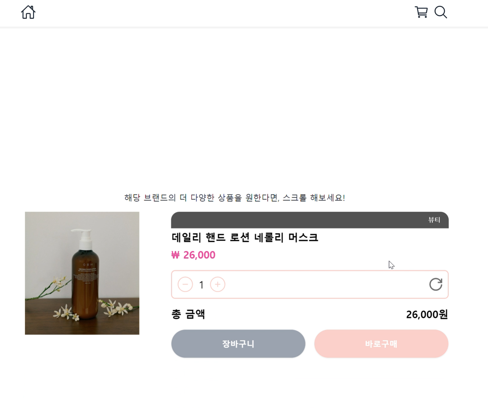
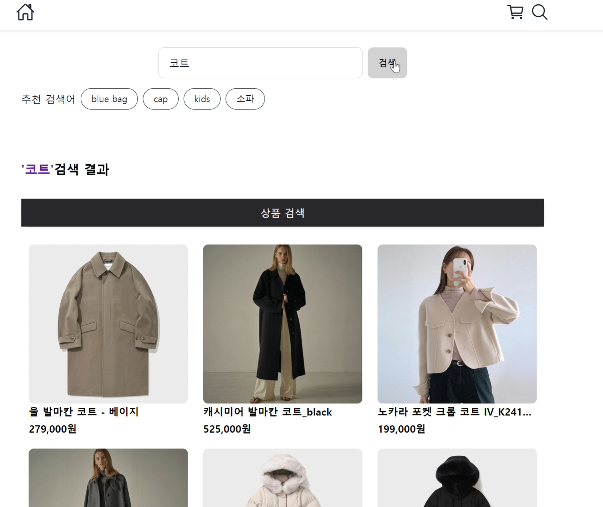
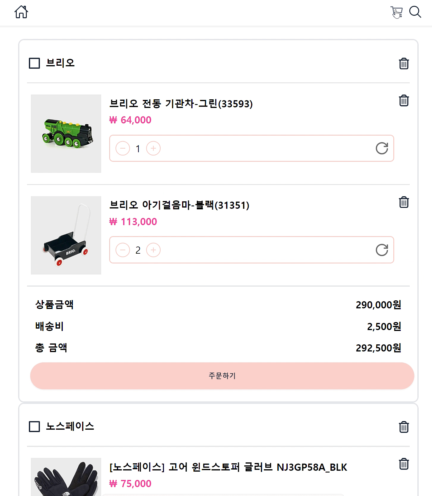
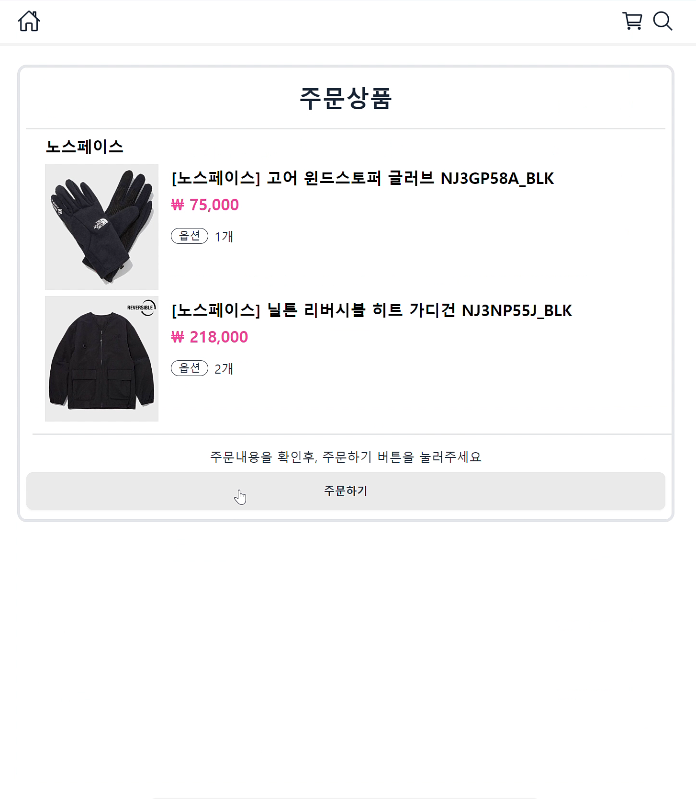

# FS(Fashion Shoppingmall Platform) 프로젝트 - 프론트엔드

## 기획

### 배경

- 평범한 쇼핑몰보다는 좀 특별한 요소를 가진 쇼핑몰을 만들고 싶었습니다
- 이를 생각해보다가, 단순히 여러 상품들을 진열해 놓은 쇼핑몰 플랫폼보다는 브랜드 자체에 좀 더 집중 할 수 있는 쇼핑몰을 만들어보자 하여
- 기존 쇼핑몰 플랫폼과는 조금 다른 UI를 가진 쇼핑몰이되었습니다.
- 관점에 따라 일반적인 쇼핑몰보다 불편할 수도 있지만, 특별한 요소를 가진 쇼핑몰이 되길 의도했다는 것을 공유드립니다. :)

### 피그마 활용

- [해당 프로젝트 피그마 파일](https://www.figma.com/file/Vd1HSUdKJhwnBnadwCmorn/fs-project?type=design&node-id=0-1&mode=design)

## 각 페이지 소개

### 메인페이지

  

- 메인페이지에 제품이 아닌 여러 브랜드들을 소개함
- 카테고리 별로 어떤 브랜드들이 있는지 나열

### 브랜드페이지

  

- 브랜드 별 자세한 설명
- 카테고리별로 상품을 볼 수 있도록 함

### 상품 페이지

- [동작 영상 링크](https://drive.google.com/file/d/1j5qJ2kzDVTFVf5-si8lzKqQYYz3Hgxw6/view?usp=sharing)
    

- 상품의 자세한 정보를 확인하고, 상품구매로 이어지는 페이지
- 해당 브랜드의 다른 상품들을 간단하게 스크롤하기만 해도 확인가능

### 검색 페이지

- [동작 영상 링크](https://drive.google.com/file/d/1r1cew2JD6G0gQkmRZ2pIEwW4MlhtT23N/view?usp=sharing)
    

- 검색 쿼리에 따른 상품 검색

### 장바구니 & 주문 페이지

- [동작 영상 링크](https://drive.google.com/file/d/1AeUgyxMsX9Ho-TvAhfZdeZPW8ctVESqg/view?usp=sharing)
    

- 장바구니에 담은 상품의 개수를 변경하거나, 삭제가능
- 주문할 상품을 주문한 이후에, 해당 상품은 장바구니에서 없어짐

## 사용 기술

### React 🎨

- 사용자 인터페이스를 만들기 위해 사용
  - react-router-dom : react에서 router를 사용할 수 있도록, 다시 말해 화면 전환을 지원하는 모듈
  - react-icons : react에서 사용할 수 있도록 유용한 아이콘들의 모음

### Recoil

- React를 위한 상태 관리 라이브러리

### VITE

- 웹 프로젝트 개발을 위한 빌드 도구
- 모듈 번들러로 esbuild를 사용
- 웹팩을 모듈 번들러로 사용하는 CRA에 비해 일반적으로 더 빠름

### AXIOS

- 자바스크립트에서 HTTP 통신을 쉽게 처리할 수 있도록 만든 HTTP 비동기 통신 라이브러리

### tailwind + daisyUI

- tailwind: CSS 프레임워크. react에서 쉽게 css를 적용할 수 있어 편함. 직접 사용해보니 직관적이라 좋았음
- daisyUI: Tailwind CSS기반 컴포넌트 라이브러리. 즉 이미 스타일을 입힌 컴포넌트들을 활용할 수 있음

### eslint

- 코딩 컨벤션에 위배되는 코드를 자동 검출하는 도구
- eslint가 코드 포맷에 관해서 신경쓰지 않게 하기 위해선,eslint-config-prettier를 설치
  - prettier와 충돌하는 ESLint 규칙을 끄는 역할

### prettier

- 설정한 코드 포맷으로 코드를 자동 변환해주는 도구

## 폴더 구조

- apis: 백엔드 api 관련 파일들을 포함하는 디렉터리
- assets: 정적 자원(이미지 등)을 담음
- atoms: 리액트 전역 상태 관련 파일들을 담음
- componets: 리액트 컴포넌트들을 담는 디렉터리
- data: 화면에 보여질 정책 관련 파일을 담음
- pages: 웹 페이지 파일들 적재

## 그외 사용 라이브러리

- nodemon : Node.js에 기반한 웹 애플리케이션 개발시, 파일에 변경사항이 발생했을 때 자동으로 애플리케이션이 재실행되도록 도와주는 패키지
- pm2

### 개선 사항

- Carausel 방향 버튼 필요
- 주문내역 페이지 -> 각 주문의 id와 해당 주문의 상태가 필요함
